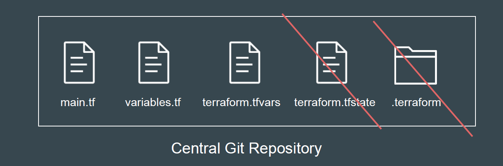
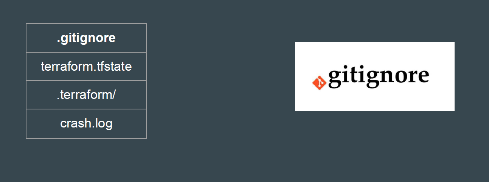

## Revising A Point Discussed in Earlier Video

While it’s good practice to commit your Terraform code files to Git, you shouldn’t
commit every file.

terraform.tfstate file should NOT be added to your Git repository.
.terraform folder should NOT be added to your Git repository.

## Files You Should Avoid Publishing to Git Repository

| Do Not Commit                         | Description                                                                 |
|--------------------------------------|-----------------------------------------------------------------------------|
| `.terraform`                         | Your .terraform directory, where Terraform downloads providers and child modules. |
| `terraform.tfvars`                   | Any .tfvars files that contain sensitive information.                      |
| `terraform.tfstate` and `terraform.tfstate.backup` | Avoid committing terraform.tfstate and backup file.               |
| `crash.log`                          | If terraform crashes, the logs are stored to a file named crash.log.       |
| `terraform.tfstate.lock.info`        | Terraform creates and deletes this file automatically when you run a terraform apply command and contains info about your state lock |
| Saved Plan Files                     | Saved plan files that you create when you include the -out flag when you run terraform plan. |

## Overview of gitignore

The .gitignore file is a text file that tells Git which files or folders to ignore in a
project.

## Always Commit the Following

Always commit:

1. All Terraform code files

2. Your .terraform.lock.hcl dependency lock file

3. A .gitignore file that excludes the files

4. A README.md to describe the code, input variables, and outputs
