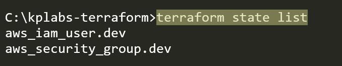
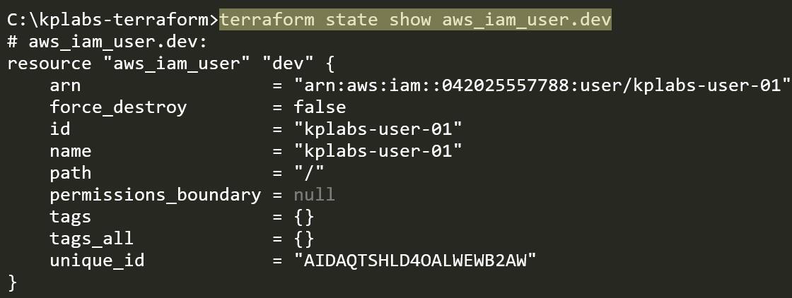
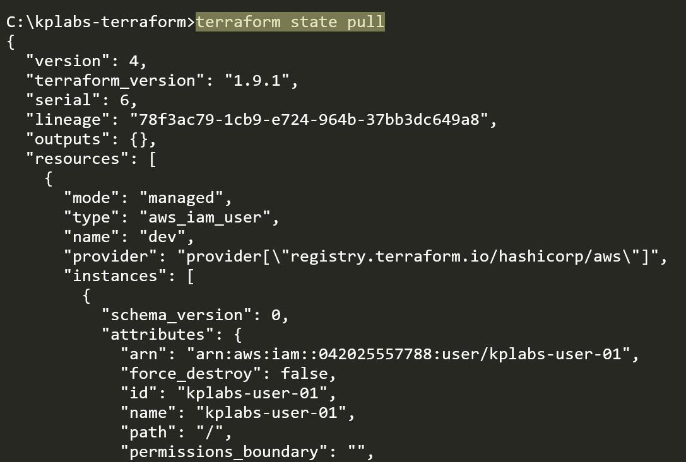
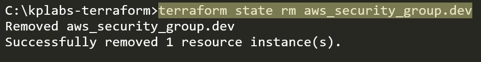
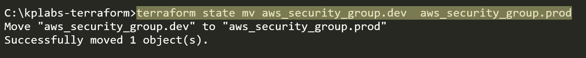
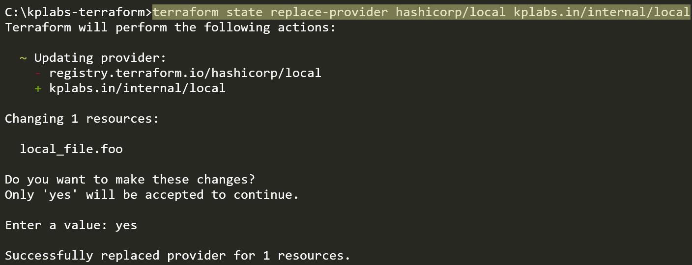

# Terraform State Management

As your Terraform usage becomes more advanced, there are some cases where
you may need to modify the Terraform state.
S
It is NOT recommended to modify the state file manually.

## State Management

The terraform state command is used for advanced state management.

| Sub-Commands      | Description                                                                 |
|------------------|-----------------------------------------------------------------------------|
| list             | List resources within terraform state file.                                 |
| mv               | Moves item with terraform state.                                            |
| pull             | Manually download and output the state from remote state.                   |
| push             | Manually upload a local state file to remote state.                         |
| rm               | Remove items from the Terraform state                                       |
| show             | Show the attributes of a single resource in the state.                      |
| replace-provider | Used to replace the provider for resources in a Terraform state.           |

### Sub-Command 1 - List

The terraform state list command is used to list resources within a Terraform
state.

Useful if you want to quickly view all resources managed by Terraform.

### Sub-Command 2 - Show

The terraform state show command is used to show the attributes of a single
resource in the state.

Useful for debugging and understanding the current attributes of a resource.

### Sub-Command 3 - pull

The terraform state pull command is used to pull the state from a remote
backend and output it to stdout.

Useful to view or backup the current state stored in a remote backend.

### Sub-Command 4 - rm

The terraform state rm command is used to remove items from the state.
Use this when you need to remove a resource from Terraform’s state
management without destroying it.

### Sub-Command 5 - mv

The terraform state mv command is used to move an item in the state to a
different address.

### Sub-Command 6 - replace-provider

The terraform state replace-provider command is used to replace the provider
for resources in a Terraform state.

