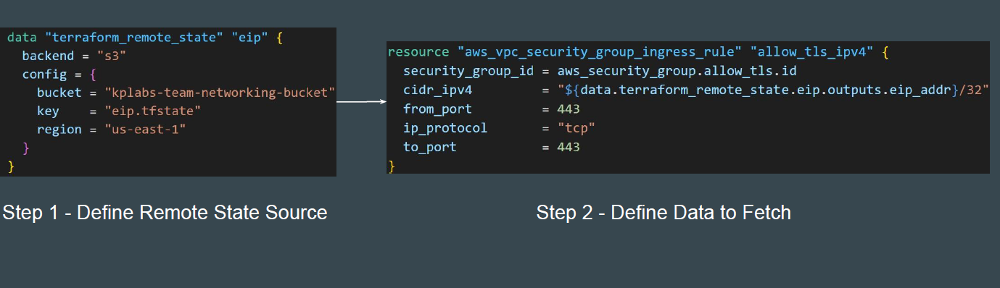

# Remote State Data Source Practical

## Practical Workflow Steps

- Create two folders for networking-team and security-team

- Create Elastic IP resource in Networking Team and Store the State file in S3
  bucket. Output values should have information of EIP.

- In Security Team, use Terraform Remote State data source to connect to the
  tfstate file of Networking Team.

- Use the Remote State to fetch EIP and whitelist it in Security Group rule.

## Introducing Remote State Data Source

The terraform_remote_state data source allows us to fetch output values from a
specific state backend

