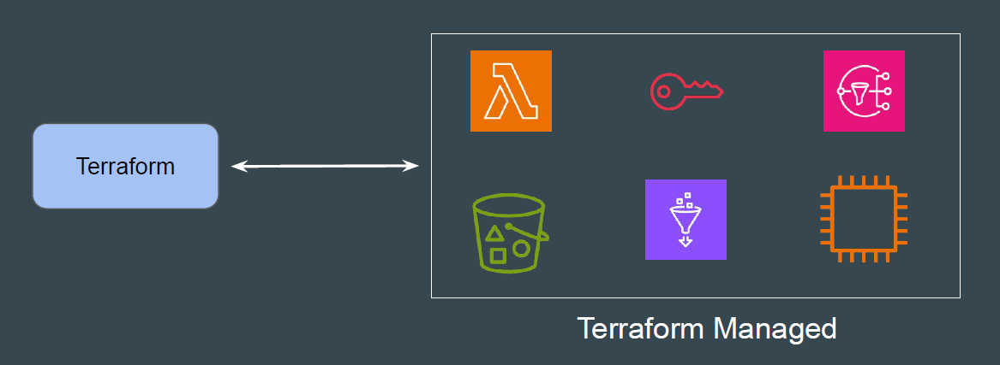
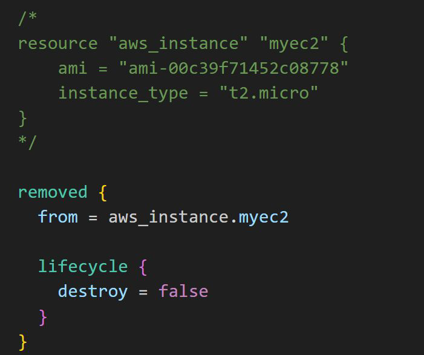
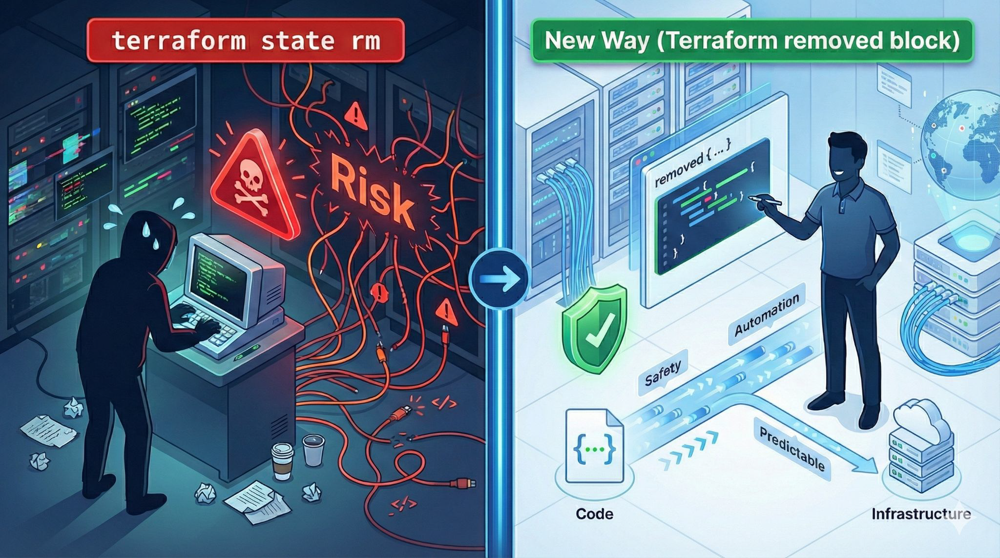

# Removed Block

## Setting the Base

Imagine you have an EC2 instance defined in your Terraform code. You decide
you still want the EC2 instance to exist in AWS, but you no longer want Terraform
to manage it (perhaps another team is taking over)

## The Old Workflow

| Step   | Action                                                                                                      |
|--------|--------------------------------------------------------------------------------------------------------------|
| Step 1 | You would delete the resource `aws_instance "example" { ... }` block from your `.tf` file.                  |
| Step 2 | You had to run a CLI command: `terraform state rm aws_instance.example`                                     |

## Disadvantage of Old Workflow

| Problems                     | Description                                                                 |
|-----------------------------|-----------------------------------------------------------------------------|
| Imperative, not Declarative | This is a manual command run by a human. It is not recorded in your code (Git). |
| CI/CD Issues                | Hard to automate safely as part of a CI/CD pipeline.                        |

## Introducing Removed Block

The removed block allows you to declare your intention to remove a resource
from the Terraform state.

It turns the imperative terraform state rm command into a declarative
configuration block.

## The Workflow

1. When you run terraform plan, Terraform notices the removed block with
destroy=false

2. Terraform will plan a ‘forget’ action, and on apply it will remove the object
from state.

3. The actual EC2 instance in AWS remains untouched.

## Resource Documentations  

<https://developer.hashicorp.com/terraform/language/block/removed>
