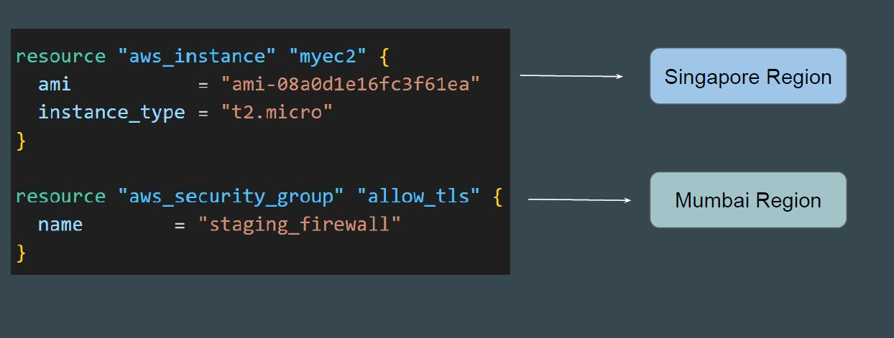
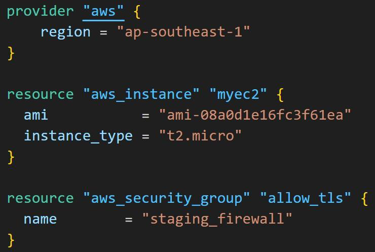
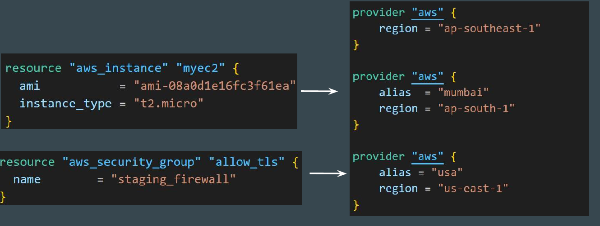

# Multiple Provider Configuration

## Understanding the Requirement

There can be a requirement that multiple resource types in the same TF file
need to be deployed in separate regions.

## Setting the Base

At this stage, we have been dealing with single-provider configuration.

In the below code, both resources will be created in Singapore region.

## Alias Meta-Argument

Each provider can have one default configuration, and any number of alternate
configurations that include an extra name segment (or "alias").

