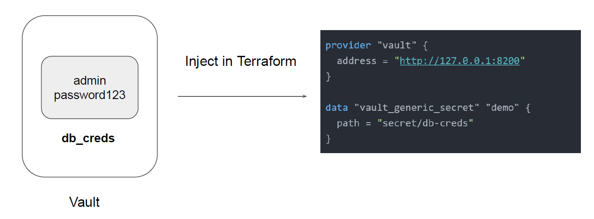

# Terraform and Vault Integration

"Back to Providers"

## Vault Provider

The Vault provider allows Terraform to read from, write to, and configure HashiCorp
Vault.

## Important Note

Interacting with Vault from Terraform causes any secrets that you read and write to be
persisted in both Terraform's state file.
