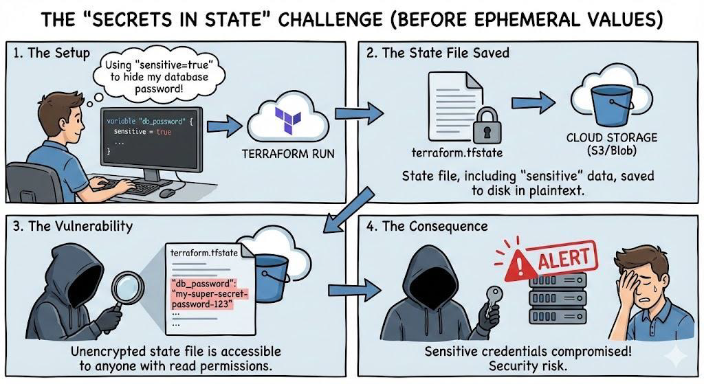
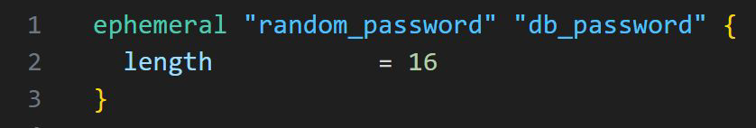
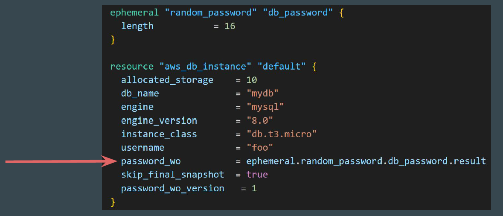
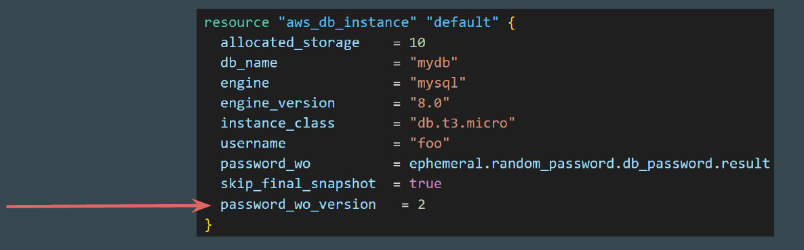
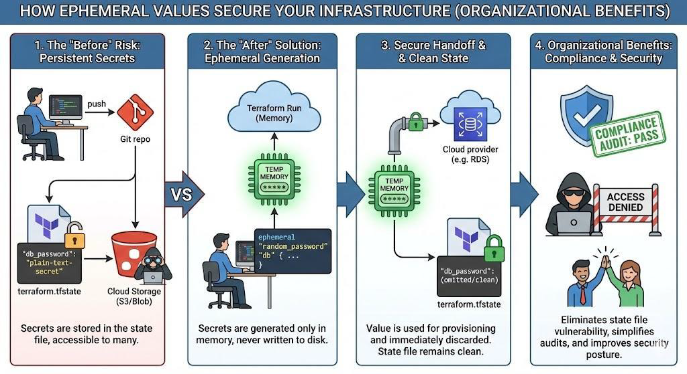

# Ephemeral Values and Write-Only Arguments

## Understanding the Challenge

By adding sensitive = true for sensitive data like passwords only redacted the
value from the CLI output. The actual value was still written in plaintext (JSON)
inside the terraform.tfstate file

## Ephemeral Blocks

The ephemeral block defines resources that are essentially temporary.

Ephemeral resources have a unique lifecycle, and Terraform does not store
information about ephemeral resources in state or plan files

## Write-only arguments

Write-only arguments let you securely pass temporary values to Terraform's
managed resources during an operation without persisting those values to state
or plan files.

## Points to Note - Part 1

To use write-only arguments, you must use Terraform v.1.11 or later and use a
resource that supports write-only arguments.

write-only arguments accept both ephemeral and non-ephemeral values.

## Points to Note - Part 2

Terraform does not store write-only arguments in state files, so Terraform has no
way of knowing if a write-only argument value has changed.

Terraform also cannot create plan diffs for write-only arguments because it does
not store those values in plan files.

Providers typically include version arguments alongside write-only arguments.
Terraform stores version arguments in state, and can track if a version argument
changes.

## Trigger an Update of Write-only Argument

To trigger an update of a write-only argument, increment the version argument's
value in your configuration:

When you increment the password_wo_version argument, Terraform notices that
change in its plan and notifies the aws provider. The aws provider then uses the
new password_wo value to update the aws_db_instance resource.

## Points to Note

The implementation of write-only arguments and their version arguments is
provider-specific, so consult the Registry for more details about your specific
provider.

## Documentation Referenced in Video

<https://registry.terraform.io/providers/hashicorp/aws/latest/docs/resources/db_instance>
