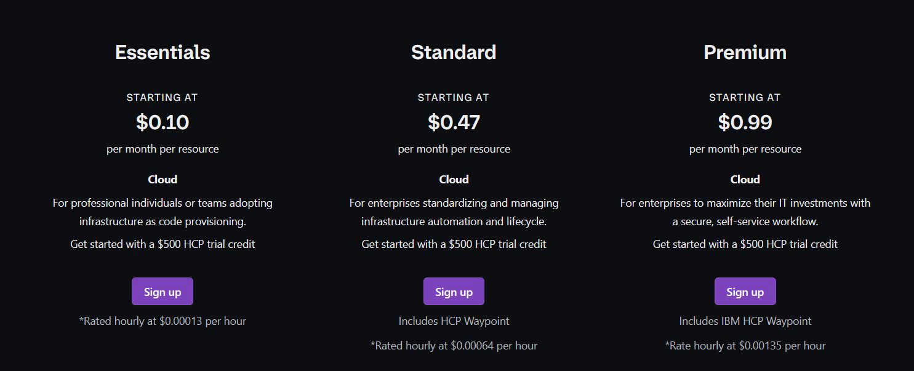
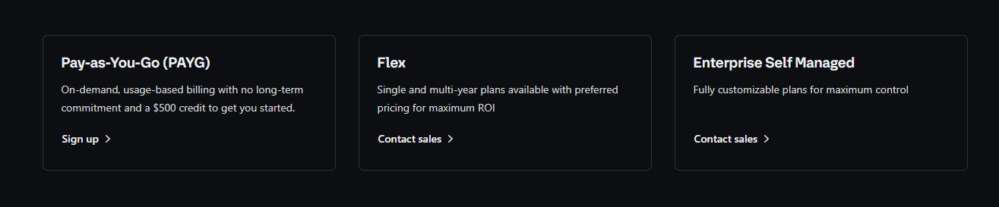

# HCP Terraform - Pricing

## Not Everything is Free

HCP Terraform is not entirely free. Depending on the usage and features
needed, there are multiple pricing plans that are available.

## Important Features Availability

| Feature                              | Essential              | Standard   | Premium    | Enterprise |
|--------------------------------------|------------------------|------------|------------|------------|
| Audit Logging                        | No                     | Yes        | Yes        | Yes        |
| Drift Detection                      | No                     | Yes        | Yes        | Yes        |
| Continuous validation                | No                     | Yes        | Yes        | Yes        |
| Policy as code (Sentinel and OPA)    | 1 Policy set 5 Policies| Unlimited  | Unlimited  | Yes        |
| Air Gap Installation                 | No                     | No         | No         | Yes        |
| Audit Trails API                     | No                     | Yes        | Yes        | No         |

