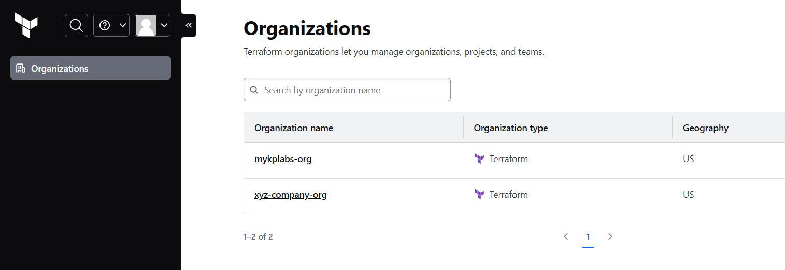
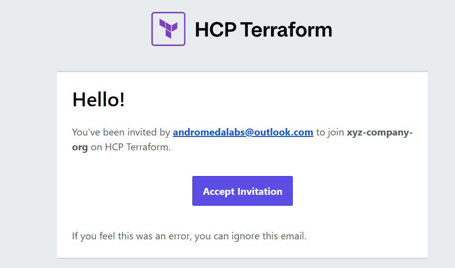
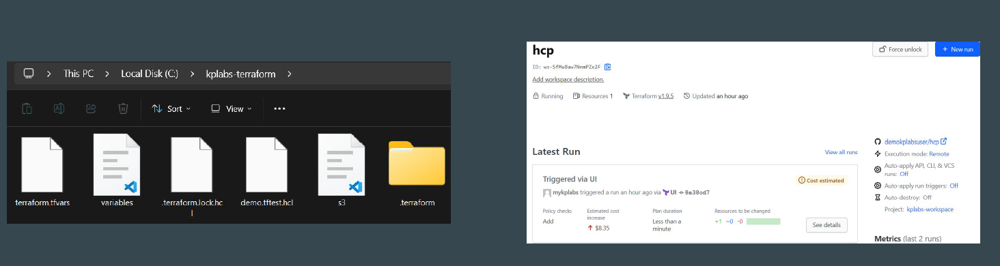
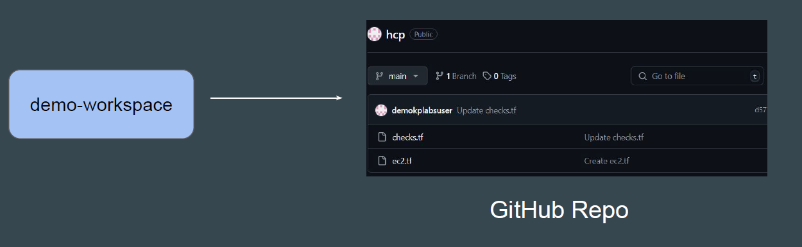
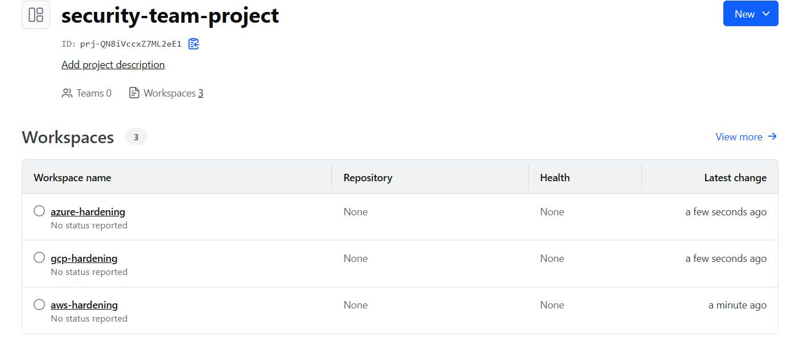

# HCP Terraform - Basic Structure

## 1- Organizations

Organizations are a shared space for one or more teams to collaborate on
workspaces.

## Points to Note - Organizations

HCP Terraform manages plans and billing at the organization level.

Each HCP Terraform user can belong to multiple organizations, which might
subscribe to different billing plans.

# 2- Workspace

HCP Terraform manages infrastructure collections with workspaces instead of
directories

## Workspace & Configuration Files

The Terraform configuration file (sample.tf) is not directly uploaded to a
workspace.

Instead, workspace is connected to GitHub repository where it can fetch code
from.

 

| Component             | Local Terraform                                              | HCP Terraform                                                                 |
|----------------------|--------------------------------------------------------------|-------------------------------------------------------------------------------|
| Terraform configuration | On disk                                                   | In linked version control repository, or periodically uploaded via API/CLI   |
| Variable values      | As `.tfvars` files, as CLI arguments, or in shell environment | In workspace                                                                 |
| State                | On disk or in remote backend                                 | In workspace                                                                 |
| Credentials and secrets | In shell environment or entered at prompts                | In workspace, stored as sensitive variables                                  |

# 3- Projects

HCP Terraform projects let you organize your workspaces into groups.

## Point to Note - Projects

You can structure your projects based on your organization's resource usage
and ownership patterns, such as teams, business units, or services.

With HCP Terraform Standard Edition, you can give teams access to groups of
workspaces using projects.
