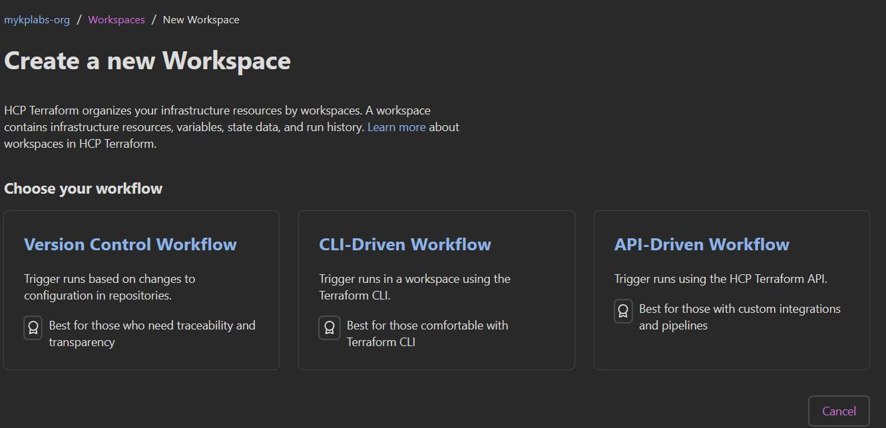
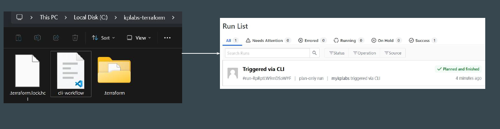

# The CLI-driven Run Workflow

## Setting the Base

Whenever we create a new Workspace in HCP, following are the 3 types of
workflow modes that are available.

## Basics of CLI Driven Workflow

In this approach, the working directory on your workstation is linked with HCP
Workspace.

The code file can be present in your laptop, and plan/apply operations can also
be initiated from local workstation.

