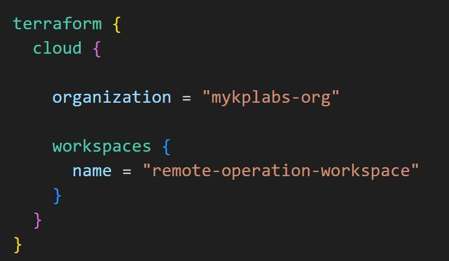
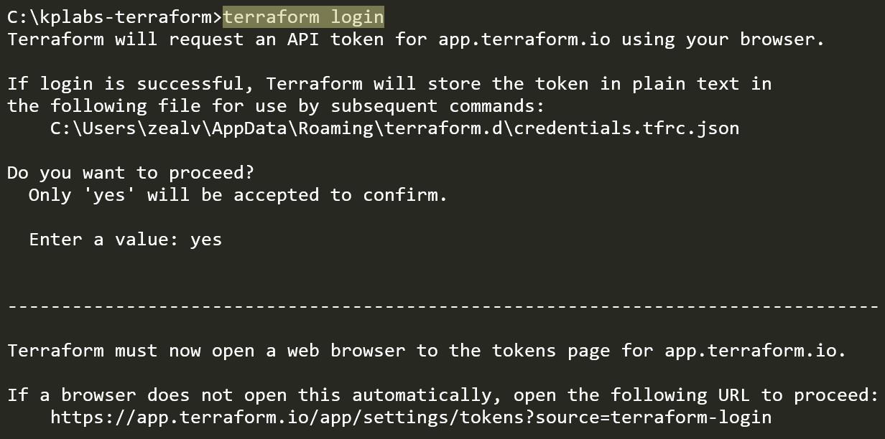
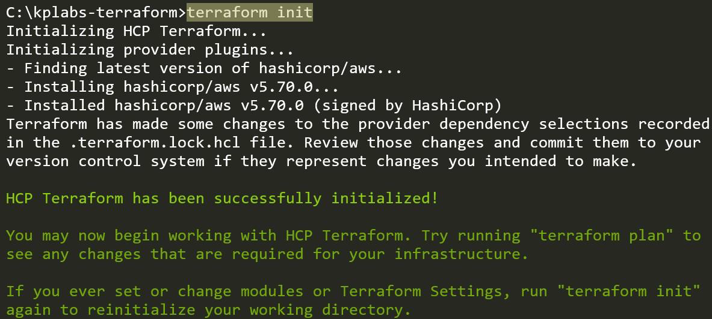
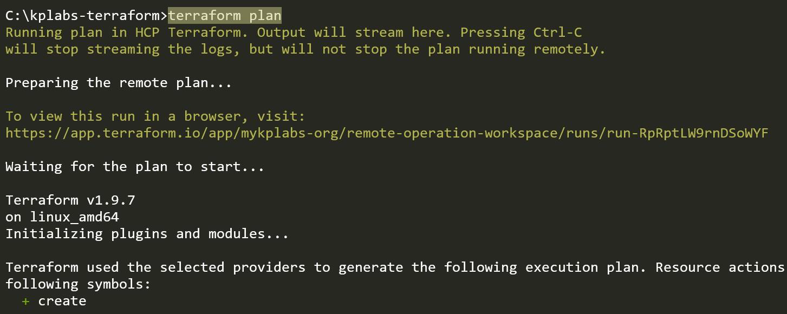

# # Step 1 - Setup Cloud Integration

You have to add code block within your .tf file to setup cloud integration.

This code will contain details about your HCP organization and workspace name.

# Step 2 - Terraform Login

Once your cloud integration code block has been added, next step is to run the
*terraform login* command.

# Step 3 - Initialize

Run the terraform init command to initialize

# Step 4 - Run the Plan / Apply Operations

Once initialized, the terraform “plan”, and “apply” commands when entered
through CLI will run in HCP Terraform with output streamlined in terminal.

