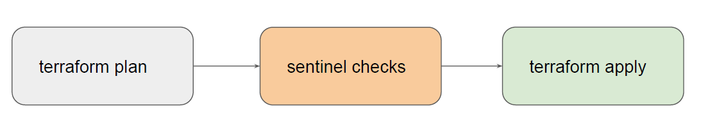
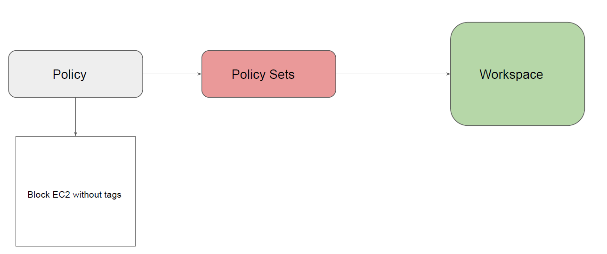

# Overview of Sentinel

Sentinel is a policy-as-code framework integrated with the HashiCorp Enterprise products.

It enables fine-grained, logic-based policy decisions, and can be extended to use information
from external sources.

Note: Sentinel policies are paid feature

## High Level Structure

