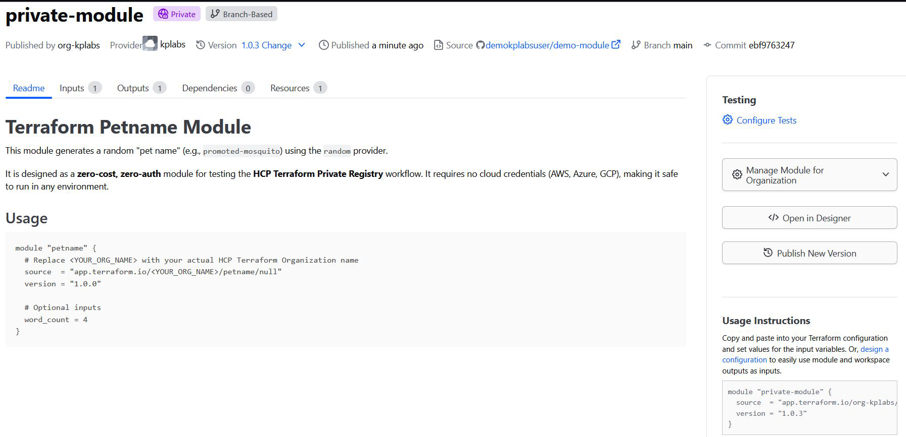
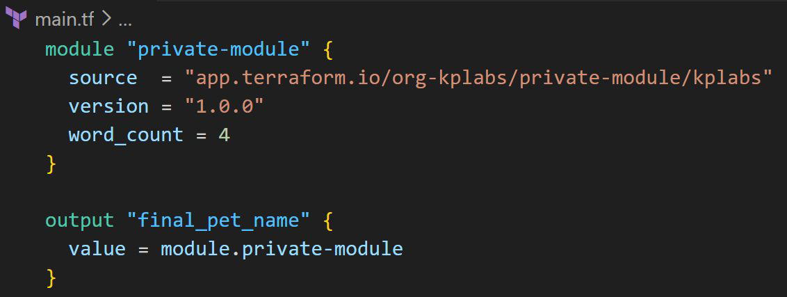

# HCP Terraform - Private Registry

## Setting the Base

HCP Terraform's private registry works similarly to the public Terraform Registry
and helps you share Terraform providers and Terraform modules across your
organization.

## Calling the Private Module

To call the Private Registry Module from your workspace, you have to specify
the correct private registry module source URL.

