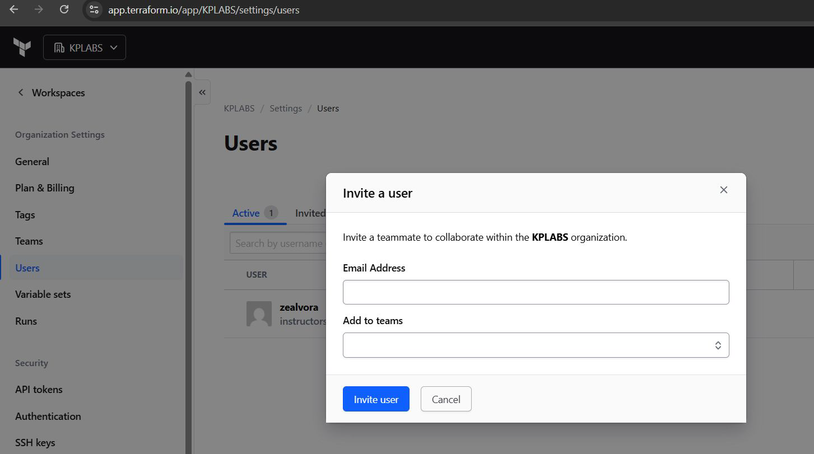
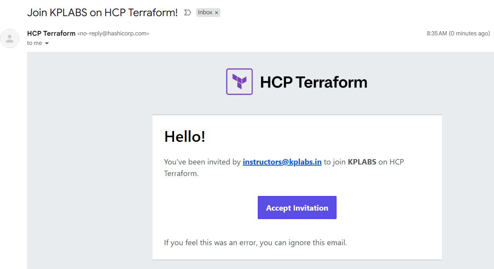
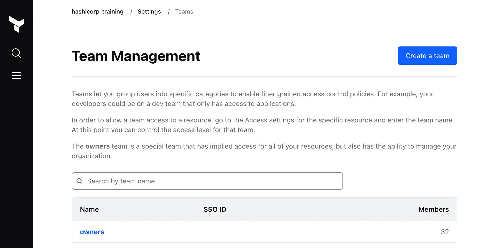

# HCP Terraform - Teams

## HCP Terraform - Users

You can invite new users to HCP Terraform Organization to collaborate on
projects.

## Reference Screenshot

Reference screenshot of user receiving the invitation to join.

## HCP Terraform - Teams

Teams are groups of HCP Terraform users within an organization.

## Point to Note

The owners team is the default team of an HCP Terraform organization.
