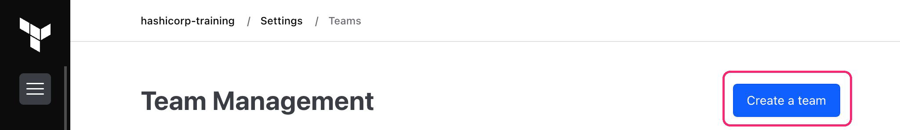
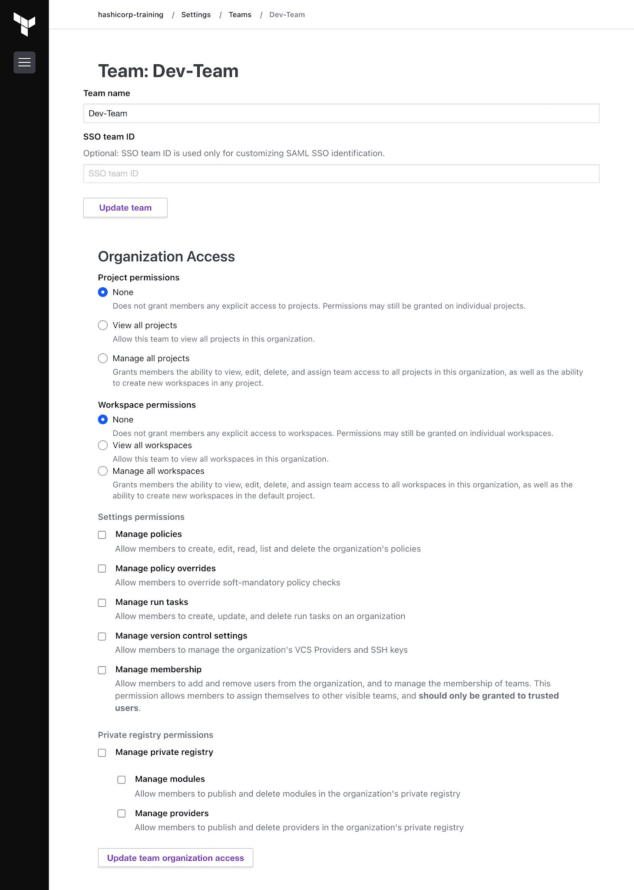
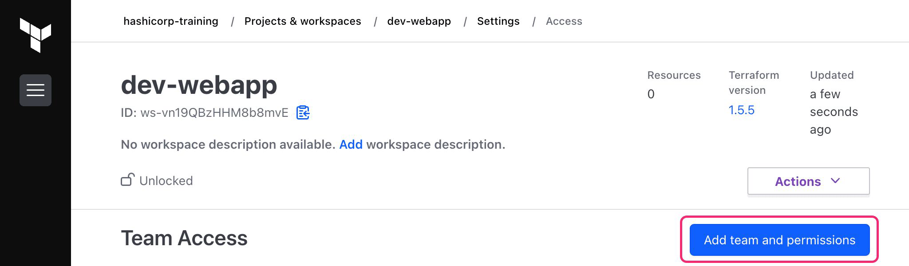
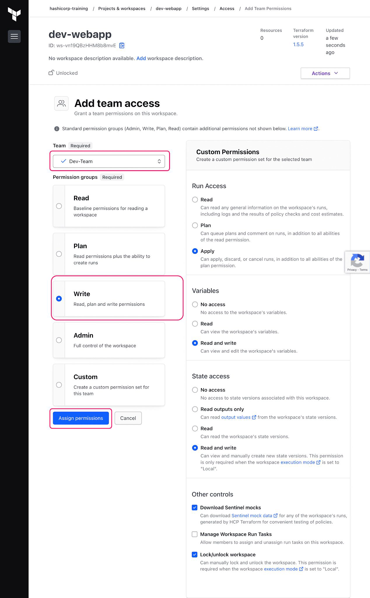
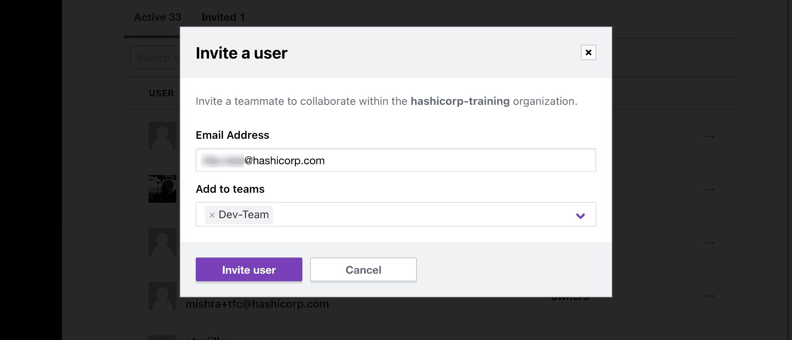

# Manage permissions in HCP Terraform

## Create a new team

The owners team is the default team of an HCP Terraform organization.

This team has every available permission in the organization, so it is important to
create restricted team access before adding new members.

 

## Workspace Level Permissions

You can configure Workspace level permissions for Teams

 

## Invite a user to your organization and team

To collaborate with your team members in HCP Terraform, you need to grant
them access to the same HCP Terraform organization.

## Point to Note

The owners team is the default team of an HCP Terraform organization.
