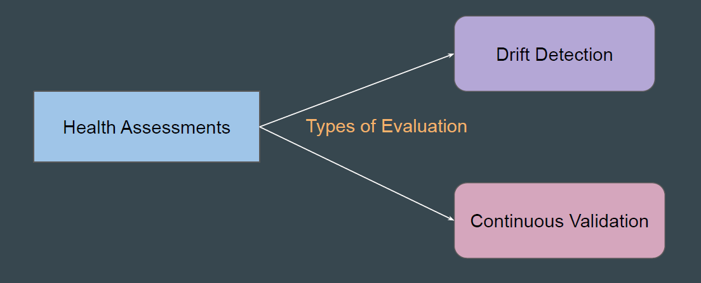
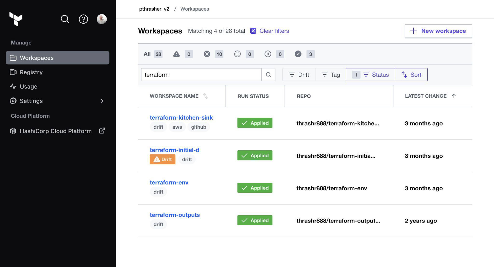
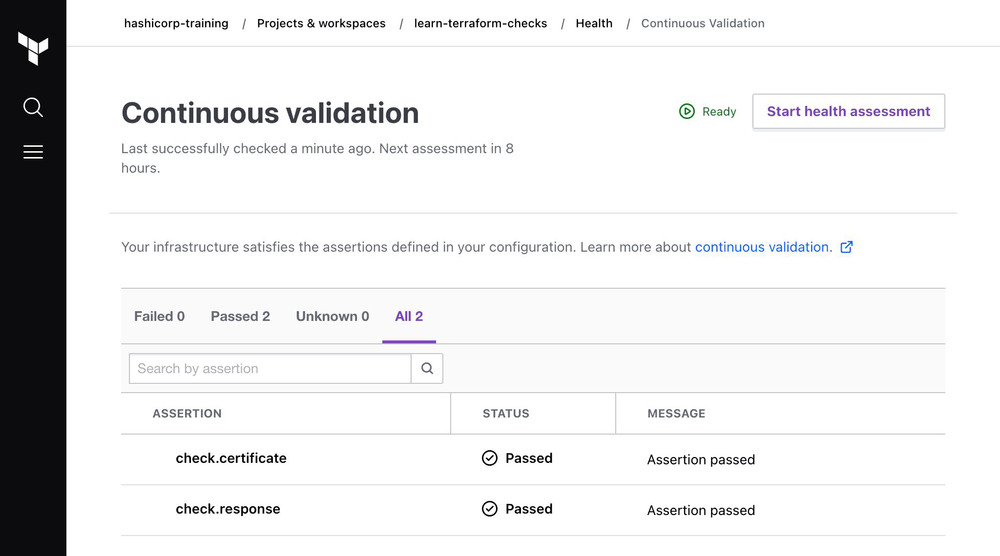
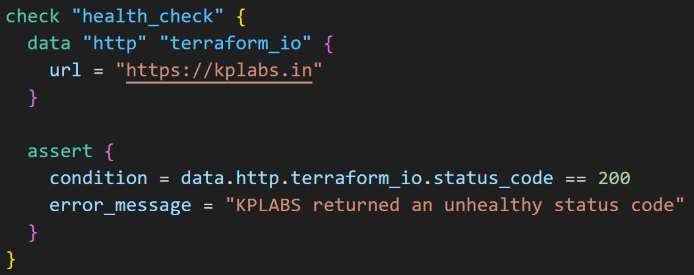

# HCP Terraform - Health Assessments

## Setting the Base

HCP Terraform can perform automatic health assessments in a workspace to
assess whether its real infrastructure matches the requirements defined in its
Terraform configuration.

## Drift Detection

Drift detection determines whether your real-world infrastructure matches your
Terraform configuration.

Configuration drift occurs when changes are made outside Terraform's regular
process (manual changes)

## Continuous Validation

Continuous validation determines whether custom conditions in the workspace’s
configuration continue to pass after Terraform provisions the infrastructure.

For example, you can monitor whether your website returns an expected status
code.

## Example - Continuous Validation

The following example uses the HTTP Terraform provider and a scoped data
source within a check block to assert the Terraform website returns a 200 status
code, indicating it is healthy.

## Point to Note

Health assessments are available in HCP Terraform Standard and Premium
editions.
