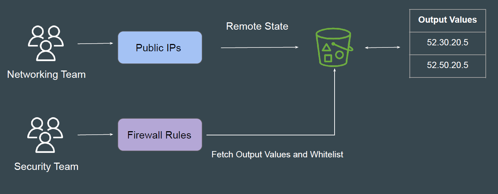
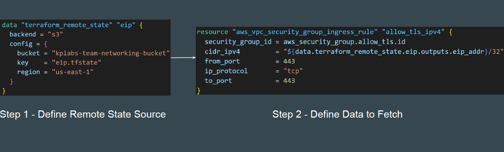
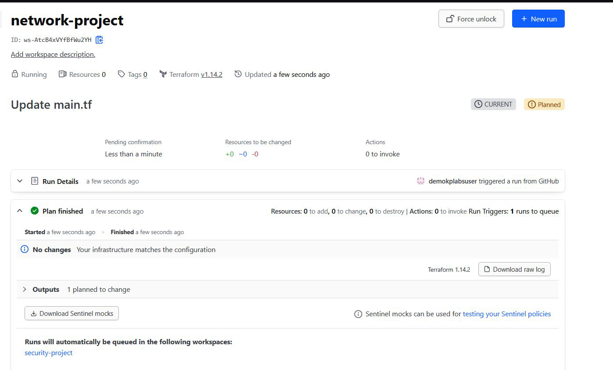
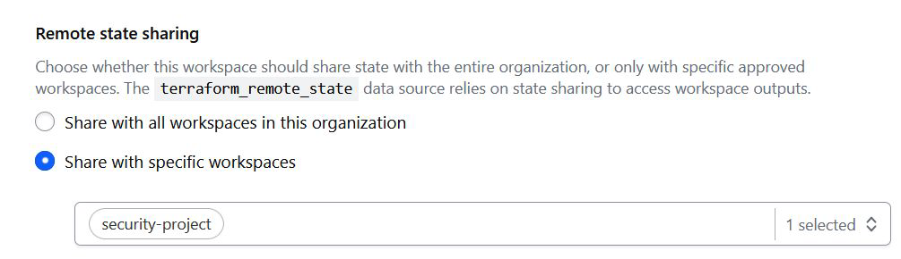
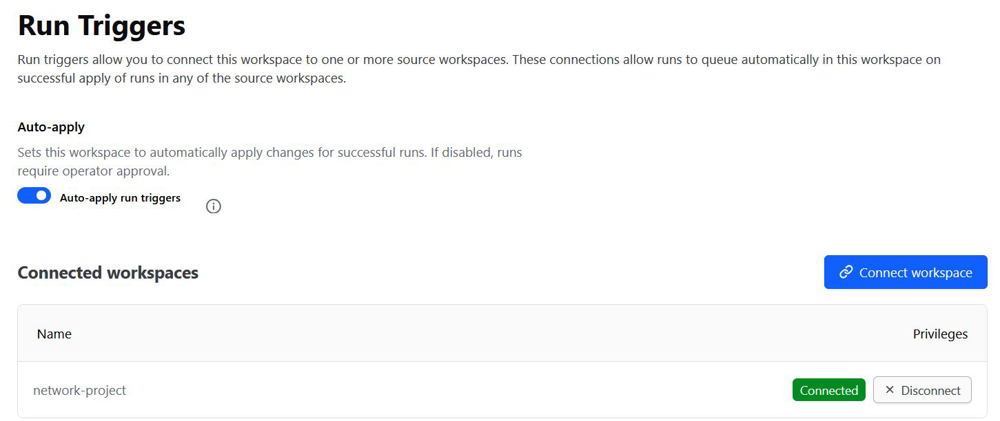
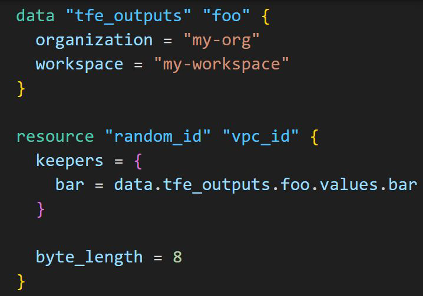

# HCP Terraform - Run Triggers

## Setting the Base

Network project contains state file whose outputs contains latest IP addresses
that needs whitelisting in security project.

## Possible Solution - Remote State Data Source

The terraform_remote_state data source allows us to fetch output values from a
specific state backend

## Challenge with Remote State Data Source

If you updated the Networking space(e.g., new Public IP), the Application space
wouldn't know about it. The infrastructure was decoupled, but the process was
manual.

## Introducing Run Triggers

If you need to update your workspace every time when a source workspace
changes, you can use Run Triggers.

## Important Configuration - 1

In the network-project workspace, you need to enable “Remote state sharing”
and designate the workspace with which you want to share the state.

## Important Configuration - 2

Within the security-project workspace, you need to configure the “Run Triggers”
settings and designate the appropriate connected namespace.

## Data Source - tfe_outputs

HashiCorp recommends using the tfe_outputs data source in the HCP
Terraform/Enterprise Provider to access remote state outputs in HCP Terraform
or Terraform Enterprise.

The tfe_outputs data source is more secure because it does not require full
access to workspace state to fetch outputs.

