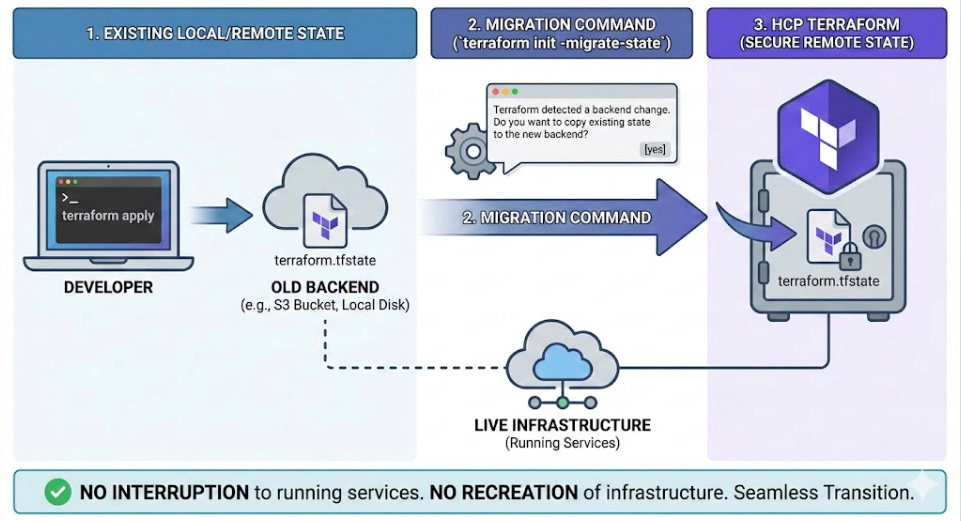
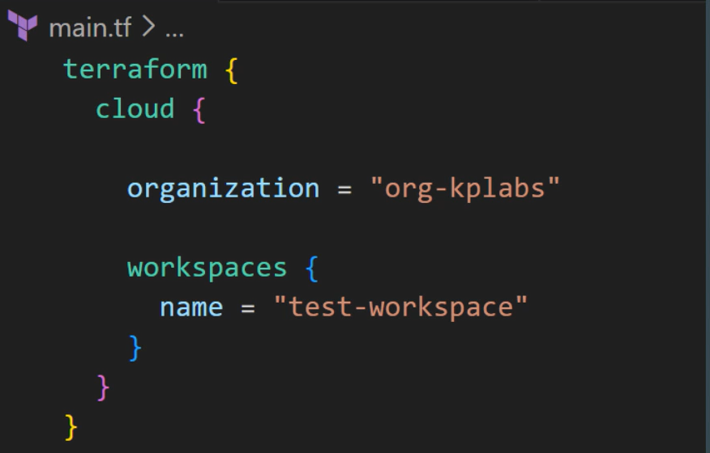
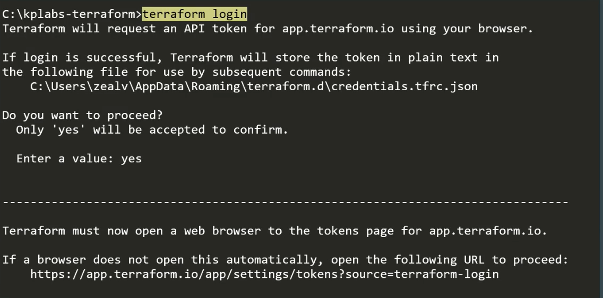
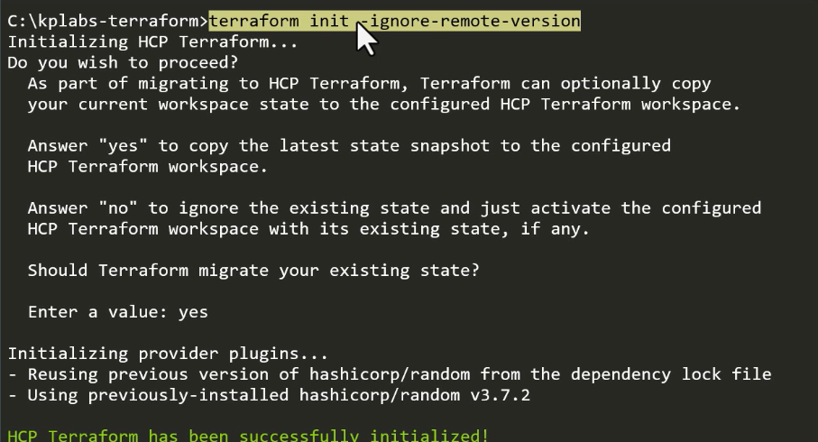

# Migrate State to HCP Terraform

## Setting the Base

HCP Terraform offers secure remote state storage, making it easier to collaborate on infrastructure development.

HCP Terraform retains **historical state versions**, which can be used to analyze infrastructure changes over time.

## Step 1 - Add Cloud Block

Include the relevant cloud code block that specifies the organization and workspace names for the HCP Terraform environment you wish to migrate your state to.

## Step 2 - Run Terraform Login

Run the `terraform login` command to ensure you have the required authentication credentials to connect to HCP Terraform.

## Step 3 - Run Terraform Init

Run `terraform init`. During this process, you will be prompted to migrate your state to HCP Terraform.

If your local Terraform version differs from the remote version, you can use the `-ignore-remote-version` flag.

## Points to Note

1. Always take a backup of your existing `terraform.tfstate` file before migration.

2. For automated environments, you can use the `terraform init -migrate-state` flag.
